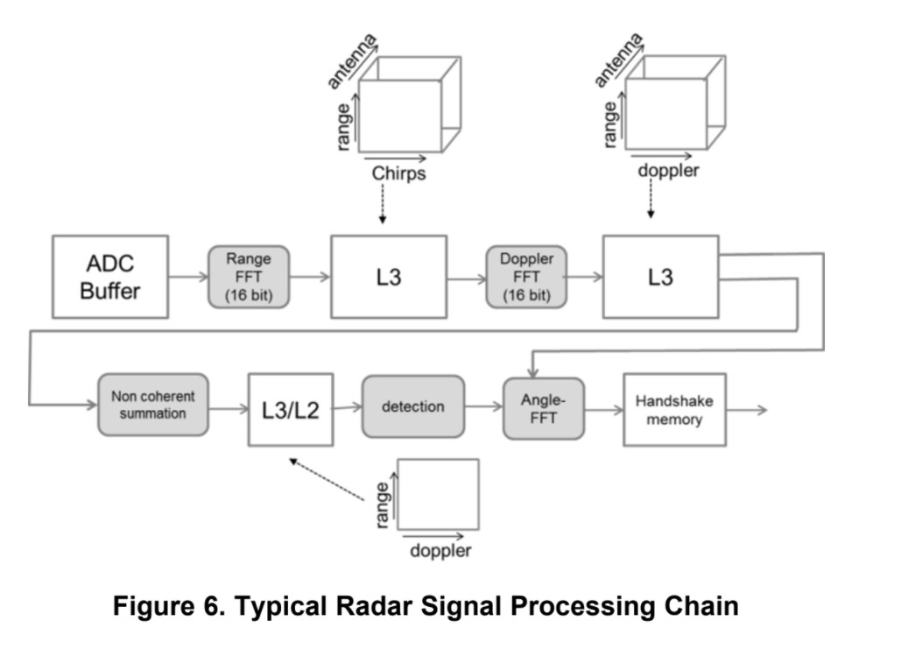

# Signal Processing Chain for Distributed MIMO Radar

Repository: <https://github.com/distributed-radar/signal_chain>

## About

The purpose of this repository is to take in raw ADC data and perform several operations on it to create several useful datasets.

Note: It is currently only tested with datasets from [mmWave Studio](https://www.ti.com/tool/MMWAVE-STUDIO). We hope to soon make this tool more generic.

## Block Diagram

## To Run

0. *Generate raw ADC data and export your configuration from wWave Studio.*
1. Edit `run_config.json` with your desired parameters.
2. Run `run.m` in MATLAB.

## Dependencies

* *[mmWave Studio](https://www.ti.com/tool/MMWAVE-STUDIO)*
* [MATLAB](https://www.mathworks.com/products/matlab.html)
  * [Signal Processing Toolbox](https://www.mathworks.com/products/signal.html)
